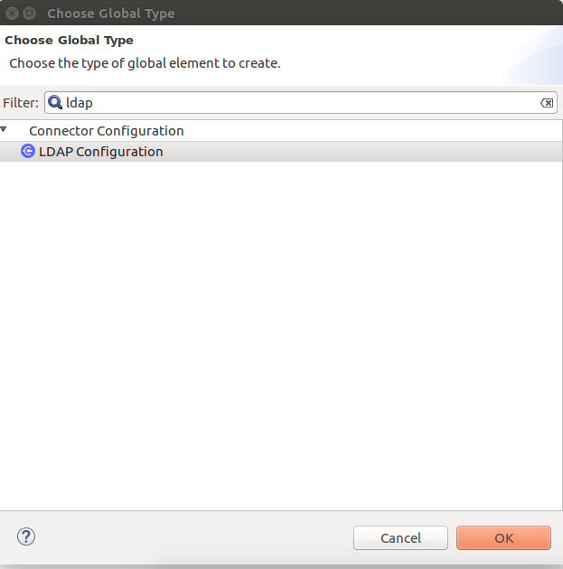
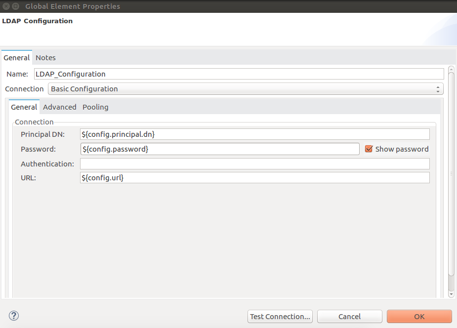
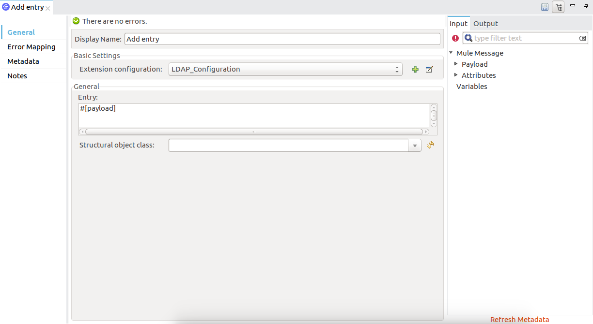
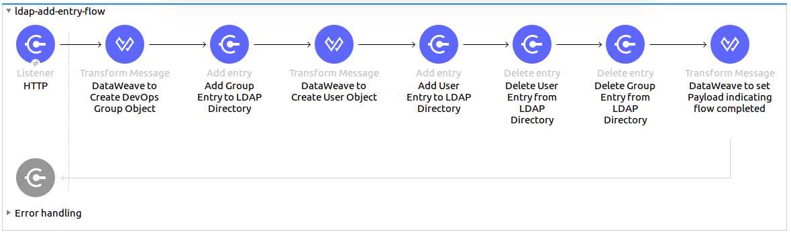

=  LDAP连接器

_选择_

本文档提供
一个简单的LDAP扩展配置示例，包括使用LDAP连接器安装和连接到LDAP服务器的基本说明。

轻量级目录访问协议（LDAP）是一种公共标准，通过互联网协议（IP）网络便于维护和访问分布式目录（如网络用户特权信息）。

许多LDAP服务器都包含在免费使用的开源项目和软件包中。安装，运行和配置LDAP服务器的详细信息不在本文的讨论范围之内。

[[prerequisites]]
== 先决条件

要使用LDAP连接器，您必须具备以下条件：

* 访问OpenLDAP，Apache目录或MicroSoft Active Directory实例。
*  Anypoint Studio 7.0版（或更高版本）或Anypoint Design Center。

要在生产环境中使用LDAP连接器，您必须具有：

* 使用Mule的企业许可证。
*  CloudHub Starter，Professional或Enterprise帐户。

本文档假定您熟悉Mule，Anypoint连接器，
Anypoint Studio基本要素，骡流中的元素以及全局元素。

[[compatibility]]
=== 兼容性

LDAP连接器与以下项目兼容：

[%header,cols="20a,80a",width=70%]
|===
|应用/服务|版本
| Mule运行时| 4.0.0
| Java | 1.8.0_x或更高版本
| Anypoint Studio | 7.0或更高版本
|===

[[install]]
== 安装连接器

. 在Anypoint Studio中，点击Studio任务栏中的Exchange图标。
. 点击Anypoint Exchange中的登录。
. 搜索连接器，然后单击安装。
. 按照提示安装连接器。

Studio有更新时，会在右下角显示一条消息，您可以单击该消息来安装更新。

[[config]]
== 配置LDAP连接器全局元素

要在Mule应用程序中使用LDAP连接器，您必须配置一个全局LDAP配置元素，该元素可以被您的应用程序需要的尽可能多的LDAP连接器使用。请注意，此连接器支持基本配置的服务器端池，可在“池”部分进行配置。

. 点击画布底部的全局元素标签。
. 在全局配置元素屏幕上，单击创建。将显示以下窗口。
+

+
. 在选择全局类型向导中，展开连接器配置并选择LDAP配置，然后单击确定。将显示以下窗口。
+

+
. 从下拉列表中提供的两个配置中选择一个 - 一个用于Basic，另一个用于TLS配置并配置其属性。
+
[%header,cols="30a,70a",width=80%]
|===
| {参数{1}}说明
|名称|输入配置的名称以引用它。
|主要DN |用户的DN（专有名称）
|密码|用户的密码
|认证|指定要使用的认证机制。默认：简单
|网址|到LDAP服务器的连接网址
|===
+
在上图中，占位符值指的是放置在项目的`src/main/resources`文件夹中的配置文件`mule-artifact.properties`。
 您可以将凭据输入到全局配置属性中，也可以引用包含这些值的配置文件。为了更简单的维护和更好的项目重用性，Mule建议您使用配置文件。如果需要将这些值保存在单独的文件中，则需要将其部署到不同的环境，例如生产，开发和质量保证（访问凭证不同）。

. 保留“高级”选项卡和“池化”选项卡及其默认条目。池选项卡仅适用于基本配置。
. 单击测试连接以确认您的全局配置参数是否准确，并且Mule能够成功连接到您的LDAP服务器实例。
. 单击确定以保存全局连接器配置。

== 使用XML编辑器或独立进行配置

。确保您已将LDAP名称空间包含在配置文件中。

[source,xml,linenums]
----

<mule xmlns:ldap="http://www.mulesoft.org/schema/mule/ldap" xmlns="http://www.mulesoft.org/schema/mule/core"
	xmlns:doc="http://www.mulesoft.org/schema/mule/documentation"
	xmlns:spring="http://www.springframework.org/schema/beans"
	xmlns:xsi="http://www.w3.org/2001/XMLSchema-instance" xsi:schemaLocation="http://www.springframework.org/schema/beans http://www.springframework.org/schema/beans/spring-beans-current.xsd
http://www.mulesoft.org/schema/mule/core http://www.mulesoft.org/schema/mule/core/current/mule.xsd
http://www.mulesoft.org/schema/mule/ldap http://www.mulesoft.org/schema/mule/ldap/current/mule-ldap.xsd">

<!-- Put your flows and configuration elements here -->
</mule>
----
 使用以下配置代码为LDAP基本配置创建一个全局元素：
[source,xml,linenums]
----
	<ldap:config name="LDAP_Configuration" doc:name="LDAP Configuration">
		<ldap:basic-connection authDn="${config.principal.dn}"
			authPassword="${config.password}" url="${config.url}">
			<ldap:extended-configurations>
				<ldap:extended-configuration key="java.naming.ldap.factory.socket"
					value="org.mule.extension.ldap.internal.util.BypassTrustSSLSocketFactory" />
			</ldap:extended-configurations>
		</ldap:basic-connection>
	</ldap:config>
----
 保存对XML文件所做的更改。

[[using-the-connector]]
== 使用连接器

LDAP连接器支持以下操作：

[%header,cols="30a,70a"]
|===
| {操作{1}}说明

| 绑定 |  针对LDAP服务器进行身份验证。这会在每次操作之前自动发生，但也可以根据要求执行。
| 搜索 |  使用给定的过滤器在基本DN中执行LDAP搜索。
| 搜索一个 |  执行应该返回唯一结果的LDAP搜索。
| 分页结果搜索 |  执行LDAP搜索并将结果流传送到流的其余部分。
| 查找 |  检索唯一的LDAP条目。
| 存在 |  检查LDAP服务器中是否存在LDAP条目。
| 添加 |  创建一个新的LDAP条目。
| 添加单值属性 |  将特定的单值属性添加到现有的LDAP条目。
| 添加多值属性 |  将特定的多值属性添加到现有LDAP条目。
| 修改 |  更新现有的LDAP条目。
| 修改单值属性 |  更新现有LDAP条目的特定单值属性。
| 修改多值属性 |  更新现有LDAP条目的特定多值属性。
| 删除 |  删除现有的LDAP条目。
| 删除单值属性 |  将特定的单值属性删除到现有的LDAP条目。
| 删除多值属性 |  将特定的多值属性删除到现有的LDAP条目。
| 重命名 |  重命名现有的LDAP条目。
|===

[[namespace-schema]]
=== 连接器命名空间和架构

在Studio中设计应用程序时，将连接器从调色板拖到Anypoint Studio画布上的操作应自动使用连接器名称空间和模式位置填充XML代码。

命名空间：`+http://www.mulesoft.org/schema/mule/ldap+`

架构位置：`+http://www.mulesoft.org/schema/mule/ldap/current/mule-ldap.xsd+`

[TIP]
如果您在Studio的XML编辑器或其他文本编辑器中手动编码Mule应用程序，请将这些粘贴到配置XML的标题中，位于`<mule>`标记内。

[source, xml,linenums]
----
<mule xmlns:ldap="http://www.mulesoft.org/schema/mule/ldap" xmlns="http://www.mulesoft.org/schema/mule/core"
	xmlns:doc="http://www.mulesoft.org/schema/mule/documentation"
	xmlns:spring="http://www.springframework.org/schema/beans"
	xmlns:xsi="http://www.w3.org/2001/XMLSchema-instance" xsi:schemaLocation="http://www.springframework.org/schema/beans http://www.springframework.org/schema/beans/spring-beans-current.xsd
http://www.mulesoft.org/schema/mule/core http://www.mulesoft.org/schema/mule/core/current/mule.xsd
http://www.mulesoft.org/schema/mule/ldap http://www.mulesoft.org/schema/mule/ldap/current/mule-ldap.xsd">

      <!-- put your global configuration elements and flows here -->

</mule>
----

=== 在Mavenized Mule应用程序中使用连接器

如果您正在编写Mavenized Mule应用程序，则此XML片段必须包含在您的`pom.xml`文件中。

[source,xml,linenums]
----
<dependency>
    <groupId>org.mule.connectors</groupId>
    <artifactId>mule-ldap-connector</artifactId>
    <version>3.0.0</version>
    <classifier>mule-plugin</classifier>
</dependency>
----

[[use-cases-and-demos]]
== 用例和演示

下面列出了LDAP连接器最常见的用例以及一些演示应用程序演练。

[%autowidth]
|===
|将用户帐户添加到Active Directory | 可以将业务用户帐户添加到基本DN上定义的Active Directory组。
|检索用户属性| 业务用户的基本属性可以用于一个或多个用途，如电子邮件或电话。
|===

[[adding-to-a-flow]]
=== 添加到流程中

. 在Anypoint Studio中创建一个新的Mule项目。
. 添加合适的Mule入站端点，例如流程开始处的HTTP监听器。
. 拖动LDAP连接器的任何操作，例如Add entry操作并将其放到画布上。
. 单击连接器以打开属性编辑器。
+

+
. 配置以下参数：
+
[%header%autowidth]
|===
| {字段{1}}说明
|显示名称|为应用程序中的LDAP操作输入唯一标签。
2 + |基本设置
|扩展配置|连接到链接到此连接器的全局元素。全局元素封装有关到目标资源或服务的连接的可重用数据。选择您创建的全局LDAP连接器元素。
2 + |一般
|条目|＃[有效载荷]，它引用在前一个组件中创建的LDAPEntry对象，通常是DataWeave组件，并作为输入载荷转换为此处理器
|===
+
. 单击结构对象类文本字段后面的刷新按钮以基于结构对象类获取元数据，该结构对象类遍历目录信息树以检索层次结构及其继承的所有属性。

[[example-use-case]]
=== 示例使用LDAP连接器的情况1

从组织单位添加和删除组织人员。

. 在Anypoint Studio中创建一个新的Mule项目。
. 将以下属性添加到`mule-artifact.properties`文件以保存您的LDAP凭据并将其放置在项目的`src/main/resources`目录中。
+
[source,code,linenums]
----
config.principal.dn=<DN>
config.password=<Password>
config.url=<URL>
----
+
. 将HTTP侦听器拖放到画布上并配置以下参数：
+
[%header%autowidth]
|===
| {参数{1}}值
|显示名称| HTTP
|扩展配置| 如果尚未创建HTTP元素，请单击加号以添加新的HTTP侦听器配置，然后单击确定（将值保留为其默认值）。
| {路径{1}} /
|===
+
. 现在让我们使用DataWeave组件创建组织单位条目。将DataWeave组件拖放到HTTP侦听器旁边并使用以下脚本。
+
[source,java,linenums]
----
%dw 2.0
output application/java
---
{
	dn : "ou=DevOpsGroup," ++ attributes.queryParams.dn,
	ou : "DevOpsGroup",
	objectclass : ["top", "organizationalUnit"]
}
----
+
. 将DataWeave组件旁边的LDAP连接器的条目添加操作添加LDAP条目。
. 通过添加新的LDAP全局元素来配置LDAP连接器。点击扩展配置字段旁边的加号。
.. 根据下表配置全局元素：
+
[%header%autowidth]
|===
| {参数{1}}说明|值
|名称|输入配置的名称以引用它。| <Configuration_Name>
|主要DN |用户的DN（专有名称）。| `${config.principal.dn}`
|密码|用户的密码。| `${config.password}`
|网址|到LDAP服务器的连接网址。| `${config.url}`
|===
+
.. 相应的XML配置应如下所示：
+
[source,xml,linenums]
----
	<ldap:config name="LDAP_Configuration" doc:name="LDAP Configuration">
		<ldap:basic-connection authDn="${config.principal.dn}"
			authPassword="${config.password}" url="${config.url}">
			<ldap:extended-configurations>
				<ldap:extended-configuration key="java.naming.ldap.factory.socket"
					value="org.mule.extension.ldap.internal.util.BypassTrustSSLSocketFactory" />
			</ldap:extended-configurations>
		</ldap:basic-connection>
	</ldap:config>
----
+
. 单击测试连接以确认Mule可以连接到LDAP服务器实例。如果连接成功，请单击确定以保存配置。否则，请查看或更正任何不正确的参数，然后再次测试。
. 回到LDAP连接器的属性编辑器中，配置添加条目操作所需的参数：
+
[%header%autowidth]
|===
| {参数{1}}值
|显示名称|将组条目添加到LDAP目录
2 + |基本设置
|扩展配置|选择您创建的全局LDAP连接器元素。
2 + |一般
|条目|＃[有效内容]，默认值
|===
+
. 现在让我们使用DataWeave组件创建组织人员条目。将DataWeave组件拖到LDAP连接器旁边，并使用下面的脚本。
+
[source,java,linenums]
----
%dw 2.0
output application/java
---
{
	dn : "cn=Test User,ou=DevOpsGroup," ++ attributes.queryParams.dn,
	uid : "testUser",
	cn : "Test User",
	sn : "User",
	userPassword : "test1234",
	objectclass : ["top", "person", "organizationalPerson", "inetOrgPerson"]
}
----
+
. 将DataWeave组件旁边的LDAP连接器的条目操作添加到LDAP用户条目中。
. 在LDAP连接器的属性编辑器中，配置参数如下：
+
[%header%autowidth]
|===
| {参数{1}}值
|显示名称|将用户条目添加到LDAP目录
2 + |基本设置
|扩展配置|选择您创建的全局LDAP连接器元素。
2 + |一般
|条目|＃[有效内容]，默认值
|===
+
. 现在我们已成功添加条目，让我们尝试使用LDAP连接器将其删除。
. 拖动删除LDAP连接器旁边的LDAP连接器的条目操作以删除LDAP用户条目。
. 在LDAP连接器的属性编辑器中，配置参数如下：
+
[%header%autowidth]
|===
| {参数{1}}值
|显示名称|从LDAP目录中删除用户条目
2 + |基本设置
|扩展配置|选择您创建的全局LDAP连接器元素。
2 + |一般
| DN | `#['cn=Test User,ou=DevOpsGroup,' ++ attributes.queryParams.dn]`
|===
+
. 将LDAP连接器旁边的LDAP连接器的另一个删除条目操作拖动到LDAP连接器以删除LDAP组条目。
+
[%header%autowidth]
|===
| {参数{1}}值
|显示名称|从LDAP目录中删除组条目
2 + |基本设置
|扩展配置|选择您创建的全局LDAP连接器元素。
2 + |一般
| DN | `#['ou=DevOpsGroup,' ++ attributes.queryParams.dn]`
|===
+
. 最后，将DataWeave组件拖放到LDAP连接器旁，以将有效负载设置为"Flow Successfully Completed"。

[[example-code]]
=== 示例使用案例1代码

将此代码粘贴到您的XML编辑器中，以便将此示例用例的流程快速加载到您的Mule应用程序中。

[source,xml,linenums]
----
<?xml version="1.0" encoding="UTF-8"?>

<mule xmlns:ee="http://www.mulesoft.org/schema/mule/ee/core" xmlns:ldap="http://www.mulesoft.org/schema/mule/ldap"
	xmlns:http="http://www.mulesoft.org/schema/mule/http"
	xmlns="http://www.mulesoft.org/schema/mule/core"
	xmlns:doc="http://www.mulesoft.org/schema/mule/documentation" xmlns:spring="http://www.springframework.org/schema/beans" xmlns:xsi="http://www.w3.org/2001/XMLSchema-instance" xsi:schemaLocation="http://www.springframework.org/schema/beans http://www.springframework.org/schema/beans/spring-beans-current.xsd
http://www.mulesoft.org/schema/mule/core http://www.mulesoft.org/schema/mule/core/current/mule.xsd
http://www.mulesoft.org/schema/mule/http http://www.mulesoft.org/schema/mule/http/current/mule-http.xsd
http://www.mulesoft.org/schema/mule/ldap http://www.mulesoft.org/schema/mule/ldap/current/mule-ldap.xsd
http://www.mulesoft.org/schema/mule/ee/core http://www.mulesoft.org/schema/mule/ee/core/current/mule-ee.xsd">

	<http:listener-config name="HTTP_Listener_config"
		doc:name="HTTP Listener config">
		<http:listener-connection host="127.0.0.1"
			port="8081" />
	</http:listener-config>

	<ldap:config name="LDAP_Configuration" doc:name="LDAP Configuration">
		<ldap:basic-connection authDn="${config.principal.dn}"
			authPassword="${config.password}" url="${config.url}">
			<ldap:extended-configurations>
				<ldap:extended-configuration key="java.naming.ldap.factory.socket"
					value="org.mule.extension.ldap.internal.util.BypassTrustSSLSocketFactory" />
			</ldap:extended-configurations>
		</ldap:basic-connection>
	</ldap:config>

	<flow name="ldap-add-entry-flow">
		<http:listener config-ref="HTTP_Listener_config" path="/"
			doc:name="HTTP" />

		<ee:transform doc:name="DataWeave to Create DevOps Group Object">
			<ee:message>
				<ee:set-payload><![CDATA[%dw 2.0
output application/java
---
{
	dn : "ou=DevOpsGroup," ++ attributes.queryParams.dn,
	ou : "DevOpsGroup",
	objectclass : ["top", "organizationalUnit"]
}
]]></ee:set-payload>
			</ee:message>
		</ee:transform>

		<ldap:add config-ref="LDAP_Configuration" doc:name="Add Group Entry to LDAP Directory" />

		<ee:transform doc:name="DataWeave to Create User Object">
			<ee:message>
				<ee:set-payload><![CDATA[%dw 2.0
output application/java
---
{
	dn : "cn=Test User,ou=DevOpsGroup," ++ attributes.queryParams.dn,
	uid : "testUser",
	cn : "Test User",
	sn : "User",
	userPassword : "test1234",
	objectclass : ["top", "person", "organizationalPerson", "inetOrgPerson"]
}
]]></ee:set-payload>
			</ee:message>
		</ee:transform>

		<ldap:add config-ref="LDAP_Configuration" doc:name="Add User Entry to LDAP Directory" />

		<ldap:delete config-ref="LDAP_Configuration"
			dn="#['cn=Test User,ou=DevOpsGroup,' ++ attributes.queryParams.dn]"
			doc:name="Delete User Entry from LDAP Directory" />

		<ldap:delete config-ref="LDAP_Configuration"
			dn="#['ou=DevOpsGroup,' ++ attributes.queryParams.dn]" doc:name="Delete Group Entry from LDAP Directory" />

		<ee:transform doc:name="DataWeave to set Payload indicating flow completed">
			<ee:message>
				<ee:set-payload><![CDATA[%dw 2.0
output application/json
---
{
	result : "Flow Successfully Completed"
}
]]></ee:set-payload>
			</ee:message>
		</ee:transform>
	</flow>

</mule>
----

[[example-use-case2]]
=== 示例使用LDAP连接器的情况2

可以设置自定义信任存储以告知允许哪些服务器与之通信。

可以使用扩展配置参数来指定自定义信任库。

除了LDAP的配置部分之外，可以使用相同的用例1（以上）来执行此操作
现在应该使用TLS配置的连接器。

在下面查找使用TLS配置和更新的LDAP连接器的XML配置片段
使用案例1的XML文件（上图）。

[source,xml,linenums]
----
<ldap:config name="LDAP_Configuration" doc:name="LDAP Configuration">
<ldap:tls-connection authDn="${config.principal.dn}"
                            authPassword="${config.password}" url="${config.url}">
    <ldap:extended-configurations>
        <ldap:extended-configuration key="org.mule.module.ldap.trustStorePath" value="the_path_to_trust_store_jks_file" />
        <ldap:extended-configuration key="org.mule.module.ldap.trustStorePassword" value="changeit" />
    </ldap:extended-configurations>
</ldap:tls-connection>
</ldap:config>
----

[[run-time]]
=== 运行演示应用程序

. 将项目保存并运行为Mule应用程序。
. 打开网页浏览器并在输入网址后检查回复：
+
`+http://localhost:8081/?dn=dc=mulesoft,dc=org+`。

