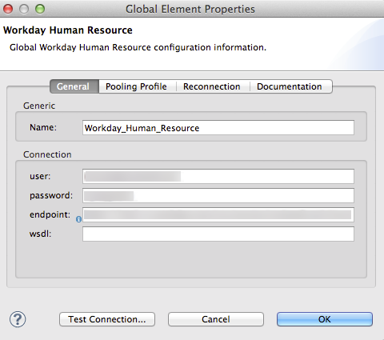

=  Workday连接器

*_Enterprise_*

通过允许您连接到Workday数据库，*Workday Connector*便于Mule集成应用程序和 http://www.workday.com[劳动日]之间的连接。它是一个标准连接器，这意味着如果您有Mule Enterprise许可证或Anypoint Platform帐户，则可以将其部署到生产环境中。

Workday Connector提供对Workday数据库中13个不同模块的访问。它允许您为每个模块执行大量操作，包括插入，查询和删除元素。

*Release Notes*： link:/release-notes/workday-connector-release-notes[Workday连接器发行说明]

本文档描述Mule图形用户界面Anypoint Studio上下文中的实现示例，并且还包括在XML编辑器中执行相同操作的配置详细信息。

== 在Studio中安装连接器

. 在Anypoint Studio中，点击Studio任务栏中的Exchange图标。
. 点击Anypoint Exchange中的登录。
. 搜索连接器，然后单击安装。
. 按照提示安装连接器。

Studio有更新时，会在右下角显示一条消息，您可以单击该消息来安装更新。

但是，要在生产环境中使用Workday Connector，您必须具有*either*：

* 一个*Enterprise license*使用Mule
*  *CloudHub*初级，专业或企业帐户

请联系mailto：info@mulesoft.com [MuleSoft销售团队]获取其中任何一个。

点击*Restart Now*完成安装。安装连接器并重新启动Studio后，可以在调色板中看到几个新的消息处理器，全部位于Connectors类别下。

image:workday-module-list.png[工作日模块列表]

或者，您也可以 link:http://mulesoft.github.io/workday-connector/guide/install[通过Maven安装此扩展]。

== 配置Workday人力资源连接器

本文档中的所有示例都关注*Workday Human Resource*消息处理器。

要使用Workday连接器，您必须配置两件事：

* 应用程序中连接器的实例
* 全球Workday人力资源连接器配置

要创建全球Workday人力资源连接器配置，请按照下列步骤操作：

. 点击画布底部的*Global Elements tab*，然后点击*Create*。
. 使用过滤器定位，然后选择*Workday Human Resource*，然后单击确定。
. 根据下表配置全局连接器的参数。
+
image:GE1.png[GE1]
+
[%header,cols="34,33,33"]
|===
一个|参数a |描述 |示例
| *Name*  |全局元素 |的名称Workday_Human_Resource1
| *User*  |用户连接到Workday。用户名应该遵循以下结构：+
用户ID @ tenantID  | USER1 @ mulesoft_pt1
| *Password*  |连接到工作日的密码| ----
 ********
----
|*Endpoint* a|URL where data server is hosted. It should follow this structure:

`+https://{your Workday domain}/ccx/service/\{your tenant name}/\{desired Workday Service}/\{desired Workday Service Version}+` | `+https://services1.workday.com/ccx/service/acme/Human_Resources/v1+
|*wsdl* |Workday WSDL location. This is not required for the connector to function properly. | 
|===

. Access the *Pooling Profile* tab to configure any settings relevant to managing multiple connections via a connection pool.
. Access the *Reconnection* tab to configure any settings relevant to reconnection strategies that Mule should execute if it loses its connection to Workday.
. Click *Test Connection* to confirm that the parameters of your global Workday connector are accurate, and that Mule is able to successfully connect to your instance of Workday. 
. Click *OK* to save the global connector configurations.
. Return to the *Message Flow* tab in Studio. Drag the Human Resource Connector onto the canvas, then select it to open the Properties Editor console.
. Configure the connector's parameters according to the table below.

+
image:Workday1.png[Workday1]
+
[%header,cols="34,33,33"]
|===
a|
Field
a|
Description
a|
Default
|*Display Name* |The name with which the element will be displayed in your flow. |Workday Human Resource
|*Config Reference* |The global element linked to this connector. Global elements encapsulate reusable data about the connection to the DB. | 
|*Operation* |The operation to perform. |Add update organization
|*Organization Find Reference* |A parameter that defines the query filter for the set of results. |#[payload]
|===

. Click blank space on the canvas to save your Workday connector configurations. +

=== Example Use Case 1:

*Note*: Get the first 100 workers in your company and create a CSV file for them.  

As a recruiter, I want to get a partial list of employees in my company and export the list to a file.

=== Using the Studio Visual Editor

. Drag an HTTP Endpoint into a new flow, and configure it with the following parameters:
+
[%header%autowidth.spread]
|===
|Property |Value
|*Host* |`localhost`
|*Path* |`getWorker`
|===
+
image:HTTP-general.png[HTTP-general]
image:HTTP-GE.png[HTTP-GE]
[TIP]
To set the host for the HTTP connector, you need to add a connector configuration. Click the plus sign (*+*) next to *Connector Configuration* (outlined above) to display the global element properties for the HTTP connector. Then, set the value of the *Host* field to `localhost`.
+
The new flow is now reachable through the path `+http://localhost:8081/getWorker+`.
+
. Add a Groovy transformer after the HTTP endpoint to deal with the message payload.
. Add the following code into the Groovy transformer. This groovy script constructs the SOAP request to get workers out of Workday.
+
[source, code, linenums]
----
//实例化一个新的getworkerrequest对象
com.workday.hr.GetWorkersRequestType getWorkersType = new com.workday.hr.GetWorkersRequestType（）;
 
//可选实例化responsefilter对象来设置页码
com.workday.hr.ResponseFilterType responseFilterType = new com.workday.hr.ResponseFilterType（）;
//设置页码
responseFilterType.setPage（1）;
//在worker对象中设置响应过滤器
getWorkersType.setResponseFilter（responseFilterType）;
 
//返回getworkerrequest对象作为消息的有效载荷
返回getWorkersType;
----

. Drag a Workday Human Resource connector into the flow. +
  image:workdayFlow1.png[workdayFlow1]

. Add a new Global element by clicking on the plus sign next to the *Connector Configuration* field.
+
image:wd2.png[wd2]

. Configure this Global Element according to the table below (Refer to <<Configuring the Workday Human Resource Connector>> for more details).
+

+
[%header%autowidth.spread]
|===
|Property |Description
|*Name* |A unique name for this global element to be referenced by connectors
|*user* |User for connecting to Workday, formatted as <user>@<Tenant ID>
|*password* |Workday password
|*endpoint* |URL of your Workday server, in the form `+https://WORKDAY_DOMAIN/ccx/service/YOUR_TENANT_NAME/WORKDAY_SERVICE/WORKDAY_SERVICE_VERSION+`,  for example, `+https://services1.workday.com/ccx/service/acme/Human_Resources/v1+`.
|===

. Back in the properties editor of the Workday Human Resource connector in your application, configure the remaining parameters according to the table below.
+
[%header%autowidth.spread]
|====
|Field |Value
|*Display Name* |Workday Human Resource
|*Config Reference* |Workday_Human_Resource (the name of the global element you created)
|*Operation* |Get workers
|*Workers Request Reference* |Leave the default #[payload]
|====
+
image:wd3.png[wd3]

. Add a DataMapper transformer, then configure it as per the steps listed below.
.. For the input type, select *Connector*. The fields should be automatically populated with the following:
+
[%header%autowidth.spread]
|===
|Property |Value
|*Connector* |Workday_Human_Resource
|*Operation* |get-workers
|*Object* |GetWorkersResponseType
|===
.. For the output type, select *CSV*, then *User Defined*. Click *Create/Edit Structure...* to specify the following data structure for the output file:
+
[%header%autowidth.spread]
|===
|Variable |Type
|*UserID* |String
|*Name* |String
|*Title* |String
|===
.. Once you have defined both input and output, click *Create Mapping*.
.. In the response data provided by the connector (listed in DataMapper's Input pane) find the *worker* element, then drag it to the output root node as shown below. This will create a new *Element Mapping*.
+
image:worker+element.png[worker+element]

.. Find the input data fields of the *worker* that you want to map to your CSV output file. Drag each input data field to its corresponding output CSV field. +
+
image:DM.png[DM]

. Add a File Endpoint at the end of your flow to output the payload to a CSV file. +
   image:workdayFlow1-final_stage.png[workdayFlow1-final_stage]
+
Configure the File Endpoint as shown below.
+
[%header%autowidth.spread]
|===
|Property |Value
|*Display Name* |`File`
|*Path* |`<desired path to create files in>`
|*Output Pattern* |`<desired filename>`
|===

. Run the project as a Mule application.
. From a browser, navigate to `+http://localhost:8081/getWorker+`.
. Mule performs the query, produces a CSV file with a list of contacts matching the query criteria, and inserts the file in the output folder you specified.

=== Using the XML Editor

. Add a *`wd-hr:config` global element* to your project, then configure its attributes and child elements according to the table below (see code below for a complete sample).
+
[source, xml, linenums]
----
<wd-hr:config name="Workday_Human_Resource" doc:name="Workday Human Resource" hrUser="<your user name> " hrPassword=" <your password> " hrEndpoint=" <your server>“>
         <wd-hr:connection-pooling-profile initialisationPolicy="INITIALISE_ONE" exhaustedAction="WHEN_EXHAUSTED_GROW"/>
</wd-hr:config>
----
+
[%header,cols="2*"]
|===
a|
Attribute
a|
Value
|*name* a|`Workday_Human_Resource`
|*doc:name* a|`Workday Human Resource`
|*objectManager* |`EAIObjMgr_enu`
|*hrPassword* |`<your password>`
|*hrEndpoint* |`<your server>`
|*hrUser* |`<your username>`
|===
+
[%header,cols="1*"]
|===
a|
Child Element
|*wd-hr:connection-pooling-profile*
|===
+
[%header,cols="2*"]
|===
a|
Child Element Attribute
a|
Value
|*initialisationPolicy*
a|`INITIALISE_ONE`
|*exhaustedAction*
a|`WHEN_EXHAUSTED_GROW`
|===

. Create a Mule flow with an *HTTP endpoint*, configuring the endpoint according to the table below (see code below for a complete sample).
+
[source, xml, linenums]
----
<flow name="workdayFlow1"doc:name="workdayFlow1">
     <http:inbound-endpoint exchange-pattern="one-way"host="localhost"port="8081"path="getWorker"doc:name="HTTP"/>
</flow>
----
+
[%header,cols="2*"]
|====
a|
Attribute
a|
Value
|*exchange-pattern*
a|`one-way`
|*host* a|`localhost`
|*port* a|`8081`
|*path* a|`getWorker`
|*doc:name* a|`HTTP`
|====
+
The new flow is now reachable through the path `+http://localhost:8081/getWorker+`. As the exchange pattern is set to one-way, no response message is returned to the requester.

. After the HTTP endpoint, add Groovy transformer:
+
[source, xml, linenums]
----
<scripting:transformer doc:name="Groovy">
     <scripting:script engine="Groovy">
     </scripting:script>
</scripting:transformer>
----
+
Include the following code inside the Groovy transformer:
+
[source, code, linenums]
----
//这个groovy脚本构造SOAP请求，让工作人员离开工作日
 
//实例化一个新的getworkerrequest对象
com.workday.hr.GetWorkersRequestType getWorkersType = new com.workday.hr.GetWorkersRequestType（）;
 
//可选实例化responsefilter对象来设置页码
com.workday.hr.ResponseFilterType responseFilterType = new com.workday.hr.ResponseFilterType（）;
//设置页码
responseFilterType.setPage（1）;
//在worker对象中设置响应过滤器
getWorkersType.setResponseFilter（responseFilterType）;
 
//返回getworkerrequest对象作为消息的有效载荷
返回getWorkersType;
----
+
The end result should look like this:
+
[source, xml, linenums]
----
<scripting:transformer doc:name="Groovy">
     <scripting:script engine="Groovy"> <！[CDATA [//这个groovy脚本构造SOAP请求让工作人员离开工作日
//实例化一个新的getworkerrequest对象
com.workday.hr.GetWorkersRequestType getWorkersType = new com.workday.hr.GetWorkersRequestType（）;
//可选实例化responsefilter对象来设置页码
com.workday.hr.ResponseFilterType responseFilterType = new com.workday.hr.ResponseFilterType（）;
//设置页码
responseFilterType.setPage（1）;
//在worker对象中设置响应过滤器
getWorkersType.setResponseFilter（responseFilterType）;
//返回getworkerrequest对象作为消息的有效载荷
返回getWorkersType;
 
]]>
     </scripting:script>
</scripting:transformer>
----

. After the Groovy transformer, add a `wd-hr:get-workers` element to your flow, configuring the attributes according to the table below.
+
[%header%autowidth.spread]
|===
|Property |Value
|*doc:name* |Workday Human Resource
|*config-ref* |`Workday_Human_Resource`
|===
+
The `config-ref` links this connector to the global element you created at the beginning of this example.
. Add a DataMapper element.
+
[source, xml, linenums]
----
<data-mapper:config name="new_mapping_grf" transformationGraphPath="new_mapping.grf" doc:name="DataMapper"/>
----
+
You must configure the DataMapper element through Studio's Visual Editor. Switch the view to Studio's Message Flow view, then click the DataMapper element to set its properties.

.. For the input type, select *Connector*. The fields should be automatically populated with the following:
+
[%header%autowidth.spread]
|===
|Property |Value
|*Connector* |Workday_Human_Resource
|*Operation* |get-workers
|*Object* |GetWorkersResponseType
|===
.. For the output type, select *CSV*, then *User Defined*. Click *Edit Fields* to specify the following data structure for the output file.
+
[%header%autowidth.spread]
|===
|Variable |Type
|*UserID* |String
|*Name* |String
|*Title* |String
|===
.. Once you have defined both input and output, click *Create Mapping*
.. In the response data provided by the connector (listed in DataMapper's Input pane) find the *worker* element, then drag it to the output root node as shown below. This will create a new *Element Mapping*.
+
image:worker+element.png[worker+element]

.. Find the input data fields of the worker that you want to map to your CSV output file. Drag each input data field to its corresponding output CSV field.
+
image:DM.png[DM]

. Add a `file:outbound-endpoint` in the flow after the DataMapper to output the payload into a CSV file. Configure its attributes according to the table below.
+
[source, xml]
----
<file:outbound-endpoint path="/Users/mulesoft/AnypointStudio/workspace/workday/testfiles" responseTimeout="10000" doc:name="File"/>
----
+
[%header,cols="2*"]
|===
a|
Attribute
a|
Value
|*path* |location in which you wish to capture the CSV file the application produces
|*responseTimeout* a|`10000`
|*doc:name* a|`File`
|===

. Run the project as a Mule Application.
. From a browser, navigate to `+http://localhost:8081/getWorker+`.
. Mule conducts the query, produces a CSV file with a list workers, and inserts the file in the output folder you specified.

== Example Code

Keep in mind that for this example to work, you must manually configure the following values of the global Workday HR connector (`wd-hr:config` element):

* hrUser
* hrPassword
* hrEndpoint

Moreover, adjust the filepath configuration to match a valid path on your local system and note that the DataMapper component must be configured manually using Studio's Visual Editor.

[source, xml, linenums]
----
<mule xmlns：data-mapper = "http://www.mulesoft.org/schema/mule/ee/data-mapper" xmlns：file = "http://www.mulesoft.org/schema/mule/file" xmlns：wd-hr = "http://www.mulesoft.org/schema/mule/wd-hr" xmlns：scripting = "http://www.mulesoft.org/schema/mule/scripting" xmlns：http = {{ } xmlns：tracking = "http://www.mulesoft.org/schema/mule/ee/tracking" xmlns = "http://www.mulesoft.org/schema/mule/core" xmlns：doc = "http://www.mulesoft.org/schema/mule/documentation"
    的xmlns：弹簧= "http://www.springframework.org/schema/beans"
    的xmlns：的xsi = "http://www.w3.org/2001/XMLSchema-instance"
     xsi：schemaLocation =“http://www.springframework.org/schema/beans http://www.springframework.org/schema/beans/spring-beans-current.xsd
http://www.mulesoft.org/schema/mule/core http://www.mulesoft.org/schema/mule/core/current/mule.xsd
http://www.mulesoft.org/schema/mule/http http://www.mulesoft.org/schema/mule/http/current/mule-http.xsd
http://www.mulesoft.org/schema/mule/ee/tracking http://www.mulesoft.org/schema/mule/ee/tracking/current/mule-tracking-ee.xsd
http://www.mulesoft.org/schema/mule/wd-hr http://www.mulesoft.org/schema/mule/wd-hr/current/mule-wd-hr.xsd
http://www.mulesoft.org/schema/mule/scripting http://www.mulesoft.org/schema/mule/scripting/current/mule-scripting.xsd
http://www.mulesoft.org/schema/mule/file http://www.mulesoft.org/schema/mule/file/current/mule-file.xsd
http://www.mulesoft.org/schema/mule/ee/data-mapper http://www.mulesoft.org/schema/mule/ee/data-mapper/current/mule-data-mapper.xsd“>
     <wd-hr:config name="Workday_Human_Resource" hrUser="" hrPassword="" hrEndpoint="" doc:name="Workday Human Resource">
         <wd-hr:connection-pooling-profile initialisationPolicy="INITIALISE_ONE" exhaustedAction="WHEN_EXHAUSTED_GROW"/>
     </wd-hr:config>
     <data-mapper:config name="getworkersresponsetype_to_csv" transformationGraphPath="getworkersresponsetype_to_csv.grf" doc:name="getworkersresponsetype_to_csv"/>
  
     <flow name="workdayFlow1" doc:name="workdayFlow1">
     <http:inbound-endpoint host="localhost" port="8081" path="getWorker" />
      <scripting:transformer doc:name="Groovy">
             <scripting:script engine="Groovy">
                 <！[CDATA [
  
//这个groovy脚本构造SOAP请求，让工作人员离开工作日
//实例化一个新的getworkerrequest对象
com.workday.hr.GetWorkersRequestType getWorkersType = new com.workday.hr.GetWorkersRequestType（）;
//可选实例化responsefilter对象来设置页码
com.workday.hr.ResponseFilterType responseFilterType = new com.workday.hr.ResponseFilterType（）;
//设置页码
responseFilterType.setPage（1）;
//在worker对象中设置响应过滤器
getWorkersType.setResponseFilter（responseFilterType）;
//返回getworkerrequest对象作为消息的有效载荷
返回getWorkersType;
  
                ]]>
             </scripting:script>
         </scripting:transformer>
         <wd-hr:get-workers config-ref="Workday_Human_Resource"  doc:name="Workday Human Resource"/>
         <data-mapper:transform config-ref="getworkersresponsetype_to_csv" doc:name="DataMapper"/>
         <file:outbound-endpoint path="/Users/mulesoft/Documents/connectors/workday/output" outputPattern="workers.csv" responseTimeout="10000" doc:name="File"/>
     </flow>
</mule>
----

== See Also

*   http://mulesoft.github.io/workday-connector/mule/modules.html[Workday Connector]
